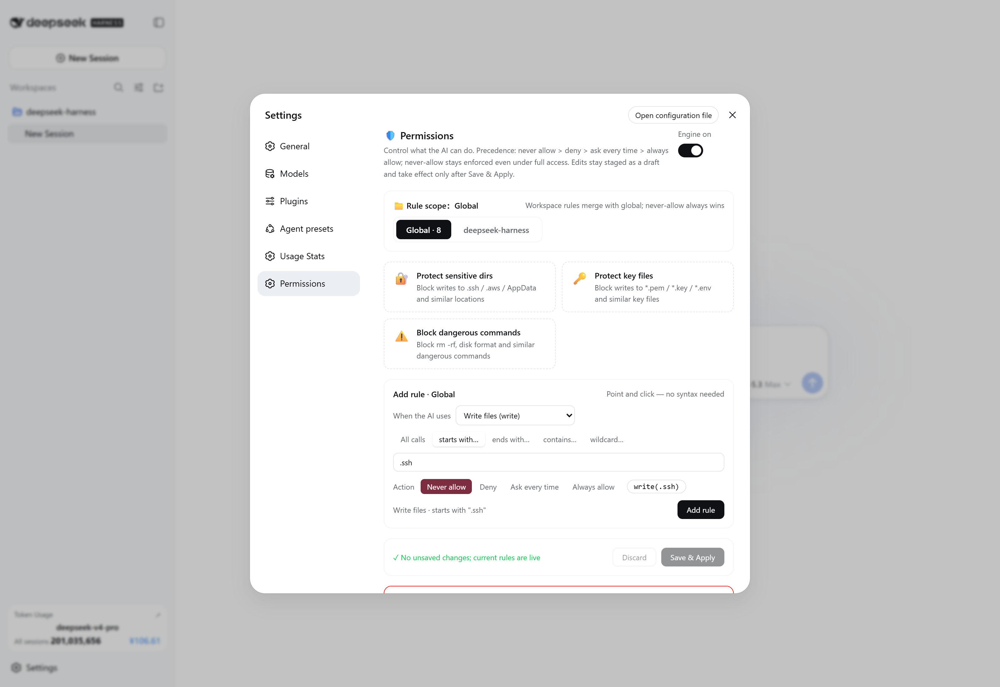
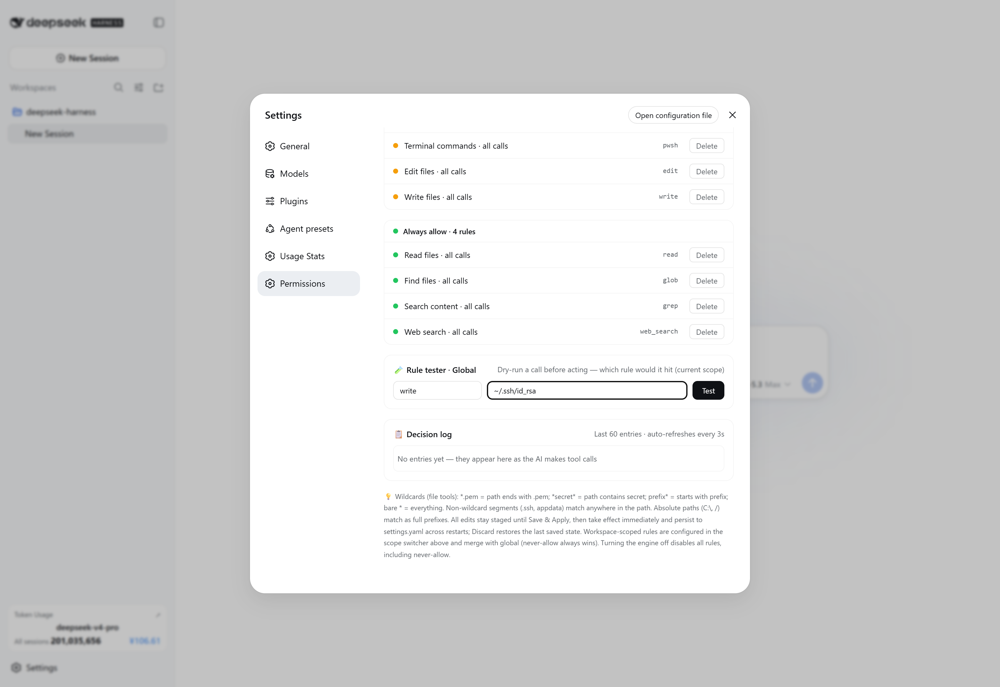
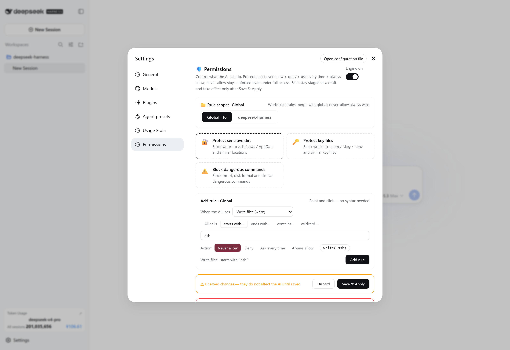

# dsh-permissions

English | [中文](./README.md)

[](https://beancookie.github.io/awesome-dsh-plugin)
[](https://awesome-dsh-plugin.com)

Claude Code-style **permission rules engine** for [DeepSeek Harness](https://github.com/deepseek-ai/deepseek-harness) (dsh). A dual-face Cordis plugin: a host engine on the `tools/pre-execute` waterfall plus a visual editor in **Settings → 权限 (Permissions)**.

## Highlights

- **Four rule tiers with strict precedence**: `hard` > `deny` > `ask` > `allow`.
- **`hard` outranks full access**: hard rules keep blocking even when the session is on the full-access preset (approval policy `never`); `ask` rules follow the session policy and auto-pass under full access.
- **Scopes**: `global` rules apply everywhere; per-`workspace` rules merge on top (deny always wins on conflict).
- **Wildcard matching** for file tools (`read`/`write`/`edit`/`glob`/`grep`/`read_image`):
  - `write(*.pem)` — path ends with `.pem`
  - `write(*secret*)` — path contains `secret`
  - `write(.ssh)` — path segment `.ssh` anywhere (case-insensitive, `\`/`/` normalized)
  - `write(C:\users\*)` — absolute-path prefix
  - bare `write` — every invocation
- **Persistence**: rules live in the `dsh-permissions` settings namespace and survive restarts (`<harness home>/settings.yaml`).
- **Model transparency**: active rules are injected into the system prompt (`[active-permission-rules]`).
- **Visual editor**: staged (draft) editing — changes apply only after **Save & Apply**, with one-click presets (protect sensitive dirs / key files / dangerous commands).

## Screenshots

| Top: scope & rule builder | Panels / tester / decision log | Staged saving |
|---|---|---|
|  |  |  |

## Rule syntax

| Rule | Meaning |
|---|---|
| `pwsh` | every call of that tool |
| `pwsh(npm run)` | first argument starts with `npm run` |
| `write(*.pem)` | file path ends with `.pem` |
| `write(*secret*)` | file path contains `secret` |
| `write(.ssh)` | path segment `.ssh` anywhere |
| `pwsh(*)` | every call (explicit) |

Non-file tools match the raw first argument by prefix. `grep` additionally matches its `path` argument.

## Install

**Option A — official installer (recommended):**

```bash
dsh plugin add dsh-permissions
```

**Option B — manual patch row:** append the `insert` list from this repo's [`cordis.patch.yml`](./cordis.patch.yml) to your profile patch (`~/.dsh/cordis.patch.yml` or `~/.dsh/profiles/<profile>/cordis.patch.yml`), after installing the package where the profile resolves it (`~/.dsh/node_modules/dsh-permissions`):

```yaml
- insert:
    - id: permissions
      name: dsh-permissions
```

Then restart the app. The **Settings → 权限** page appears automatically; the engine starts with safe defaults (16 hard rules protecting `.ssh` / `.aws` / `.gnupg` / `AppData` / `*.pem` / `*.key` / `*.env` / `*.htpasswd`, plus `deny: pwsh(rm -rf *)`).

## Permissions page

- Engine toggle, three one-click preset cards, a point-and-click rule builder (action × tool × match mode × value → live preview), and four colored rule panels.
- All edits are **staged**: nothing affects the agent until you click **Save & Apply**; **Discard** restores the last saved state.

## Security notes

- The engine only narrows the session's existing sandbox/approval posture: `allow` skips this plugin's own ask but never bypasses the DSH sandbox or `tools.guard` guards.
- Denials surface to the model as `Error: 权限规则拒绝…` (hard: `硬规则拒绝（高于 full access，不可豁免）…`), so the agent can route around blocked calls.
- The settings route (`GET/POST /api/dperm/rules`) is the namespace owner's own endpoint — the DSH api-proxy's settings allowlist intentionally does not expose third-party namespaces.

## Development / publishing

See [PUBLISH.md](./PUBLISH.md) for the release checklist and the pitfalls we hit (client package `exports` must include `./package.json`; bundle id must equal the package name; no unbounded method refs into React's `useSyncExternalStore`).

## License

MIT
